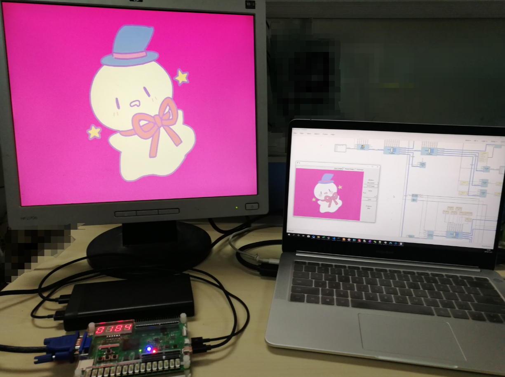

# blockystudio-billboard

Wireless SoPC billboard  
A verification and template project for BlockyStudio and platform-picorv32

Using SparkRoad-V board with Anlogic EG4S20

## Related repo

BlockyStudio repo:
https://github.com/nekomona/BlockyStudio

PlatformIO platform descriptor repo:
https://github.com/nekomona/platform-picorv32

PlatformIO platform resource repo:
https://github.com/nekomona/platform-picorv32-resource

## File structure

* billboard-sys/  
  BlockyStudio project for billboard

* billboard-sys-tdproj/  
  Anlogic TD project exported from the BlockyStudio project

* pio-billboard/  
  PlatformIO project for billboard software

* img_client/  
  Host program to transmit image to the billboard

